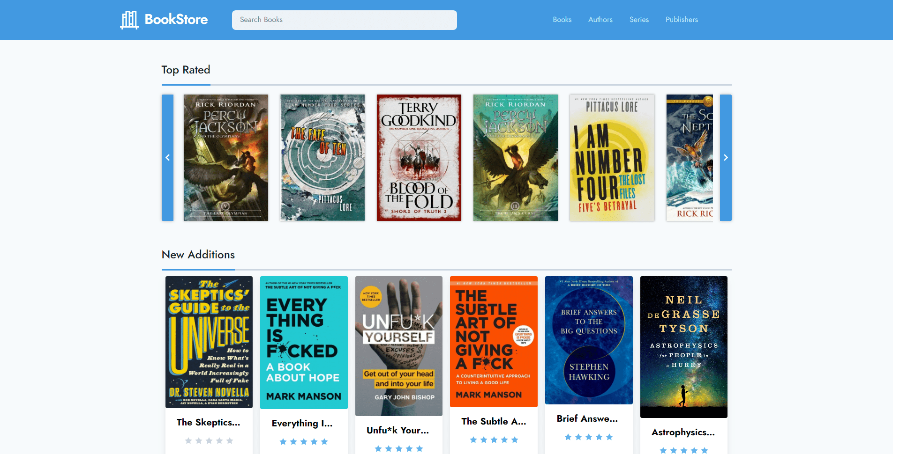

<div align="center">
    <h1></h1>
    <p>
        <b>BookStore</b> is a lightweight web application to display and share your calibre library. It is built with the Laravel Framework as backend and Tailwind for the interface.
    </p>
</div>


<div align="center">
    
</div>


## Installation

Clone the repository	
```sh
git clone https://gitlab.com/gerardbalaoro/bookstore.git
```

Install composer dependencies
```sh
composer install
```

Setup application environment (**.env**) file
```sh
cp .env.example .env
```
> **See:** https://laravel.com/docs/5.8/configuration#environment-configuration

Build application assets (optional)
```sh
npm install && npm run prod
```


### Configuring Calibre

This application uses Laravel's Filesystem interface, as such, the library can be stored locally (using the LocalAdapter) or supported cloud services such as Amazon S3 or Dropbox. You can configure them by following the [documentation](https://laravel.com/docs/5.8/filesystem#custom-filesystems).

Once the filesystem disks are setup, append the following values to your **.env** file.

```env
CALIBRE_DISK={{ Filesystem disk }}
CALIBRE_PATH={{ Path to calibre library }}
```

Laravel requires SQLite databases to be stored locally, thus, copy your calibre database file (**metadata.db**) to **storage/app/calibre**. Or if your filesystem is already setup, run the command below to download the database directly from your storage disk:

```sh
php artisan calibre:download-db
```


### Deployment

Follow the instructions on the [Laravel Documentation](https://laravel.com/docs/5.8/deployment).


## Author

- **Gerard Balaoro**
    - Email: [gmbalaoro@outlook.com](mailto:gmbalaoro@outlook.com)
    - GitHub: [@GerardBalaoro](https://github.com/GerardBalaoro)
    - GitLab: [@gerardbalaoro](https://gitlab.com/gerardbalaoro)


## License

This work is licensed under the **[MIT License](https://opensource.org/licenses/MIT)**

